# Experiments with 4:1 BALUNs for Ham Radio

## Experimenting with wiring style
### Core size T114

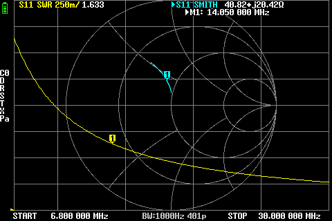
*Core T114 with parallel turns*

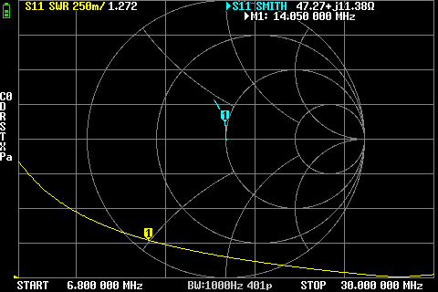
*Core T114 with twist-pair turns*

### Core size T140

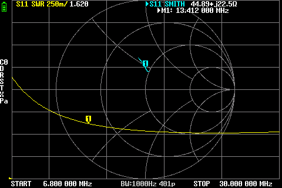 
*Core T140 with parallel turns*

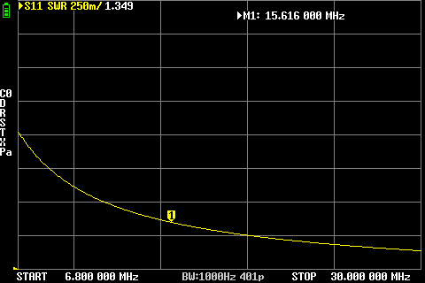
*Core T140 with twist-pair turns*

### Core size T240
Because of the large wire size, it is impractical to twist the wires so we only ran the test for parallel turns

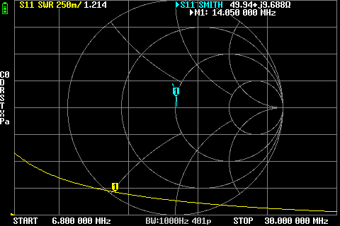
*Core T240 with parallel turns*

In this test the plots show that a twisted pair of wires have a slight better performance. Although for the T240 core I used 16AWG which is impractical to twist so I couldn't test that combination.

## Experimenting with toroid material
### Material 43

*Toroid type T114-43*

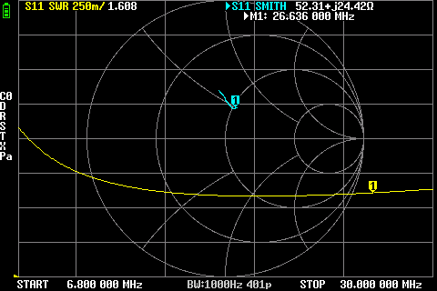
*Toroid type T140-43*

### Material 61

*Toroid type T140-61*

*Toroid type T240-61*

In this experiment the plots show that the #61 material is slightly better than #43 in the 40m - 10m ham radio bands.

## Experimenting with different number of turns
So far it appears that the T240-61 core has the better performance so for the next couple tests I only used this core. I used enameled copper wire with the thickness of 16AWG for all experiments.

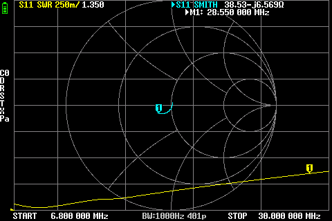
*Toroid size T240-61 with 10 turn per side*

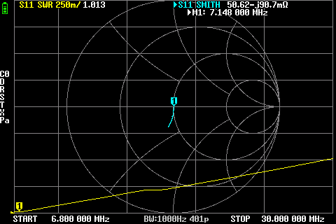
*Toroid size T240-61 with 11 turn per side*

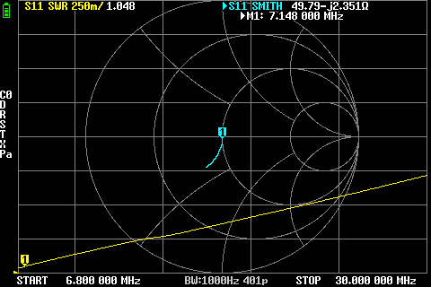
*Toroid size T240-61 with 12 turn per side*

It appears that 10 turns of 16AWG on a T240-61 toroid gives the best overall performance. In my practical application I only use 100W of RF power for which this core and wire gauge is way overkill but since it gives a slightly better performance, this is what I used in my field applications.

## *Nota Bene*
The SWR that I'm reading corresponds to the same length of hookup wires from the terminals of the transformer to the SMA connector that goes to the Vector Network Analyzer. Your experiments might vary with different lengths of hookup wire.

## Experimenting with Litz wire
Blast from the past; Litz wire was used in the early days of radio for some assumed performance gains. Litz wire consists of dozens of very thin individually coated copper wires bunched together. Since RF travels only on the surface of the wire, this gives the overall cable much more surface area than monofillar wire. In time, this was disproven and regular single-core enameled copper wire became the norm for RF transformers. Nevertheless, I wanted to see if there are any measurable gains for using Litz wire.

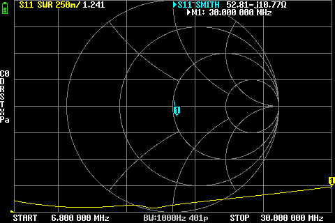
*Toroid size T240-61 with 10 turn Litz per side*

Plot shows a slightly better performance than single-core 16AWG enameled wire. But we're really splitting hairs here (pardon the pun). For all intended reasons they are so close in performance that their practical application would be indistinguishable. Band conditions will be the determining factor, not the slight edge of one transformer over the other.

## In conclusion
We tested a few core sizes, wire size, wire wrapping style and specialized wire to give us an insight into how they might affect the performance of 4:1 BALUN transformers. The comparison can be further improved of course; I didn't have all combinations of cores sizes, materials, winding patterns and wire sizes. Nevertheless, this tests gives us some information about what to expect when winding a 4:1 BALUN. In my test, a T240-61 core and using 16AWG single-core enameled copper wire, or Litz wire, had a slightly better performance than the rest. But slightly! In reality, dare I say, any of these two cores would've been undistinguishable, with the band conditions playing a much bigger role. 

It was a fun experiment and interesting to see that Litz wire, even though not really used anymore, can still have some interesting applications in ham radio. 

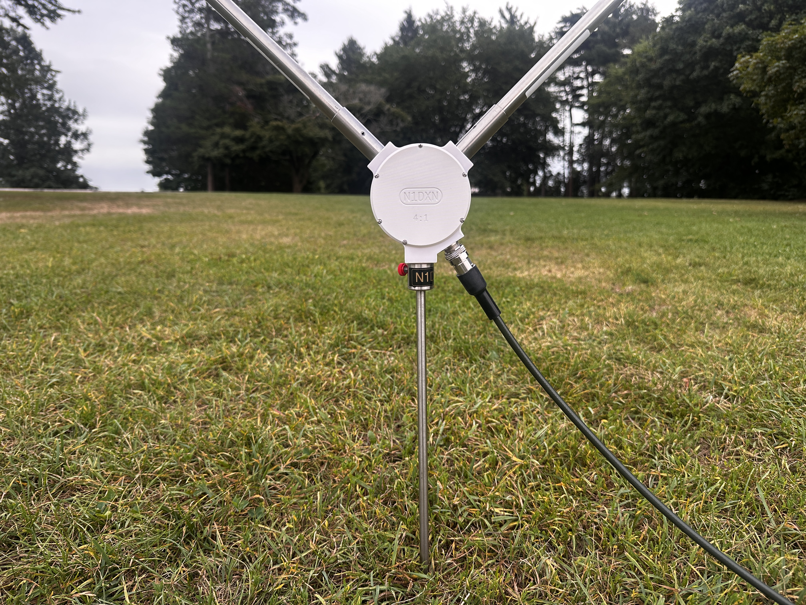
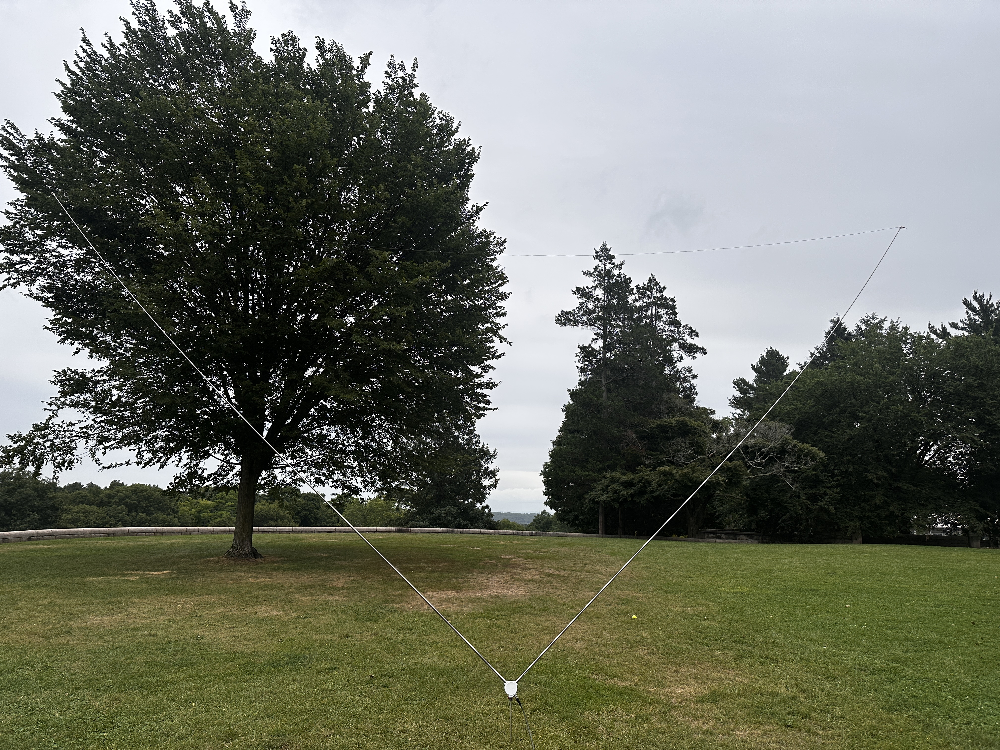

I ended up using the core with the Litz wire to make a self-contained 4:1 BALUN transformer to be used for Delta loop antennas and other loop antennas in this category. I fabricated the BALUN housing out of Rigid-10K photopolimerizing resin from Formlabs. This incredibly though material can withstand 10,000PSI making the housing virtually indestructible with usual field operations. For radiating elements, I used two stainless steel 17' telescopic whips from Chameleon antennas, and connected at the ends with a 25' 18AWG wire radiator. The resulting loop antenna is naturally resonant on 18-ish MHz which places it in the 17m amateur radio band. With the help of a tuner, I could get the radio and antenna tuned on every band from 40m to 6m, with an SWR no higher than 1.7:1. The 20m ham band seemed to be the hardest to tune (which had the 1.7:1); every other band were tuning 1.1:1 - 1.4:1.
